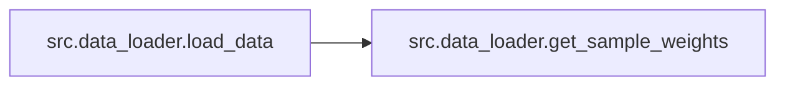

# Src Data Loader

[_Documentation generated by Documatic_](https://www.documatic.com)

<!---Documatic-section-Codebase Structure-start--->
## Codebase Structure

<!---Documatic-block-system_architecture-start--->
```mermaid
None
```
<!---Documatic-block-system_architecture-end--->

# #
<!---Documatic-section-Codebase Structure-end--->

<!---Documatic-section-src.data_loader.get_sample_weights-start--->
## src.data_loader.get_sample_weights

<!---Documatic-section-get_sample_weights-start--->
<!---Documatic-block-src.data_loader.get_sample_weights-start--->
<details>
	<summary><code>src.data_loader.get_sample_weights</code> code snippet</summary>

```python
def get_sample_weights(labels):
    counter = Counter(labels)
    counter = dict(counter)
    for k in counter:
        counter[k] = 1 / counter[k]
    sample_weights = np.array([counter[l] for l in labels])
    return sample_weights
```
</details>
<!---Documatic-block-src.data_loader.get_sample_weights-end--->
<!---Documatic-section-get_sample_weights-end--->

# #
<!---Documatic-section-src.data_loader.get_sample_weights-end--->

<!---Documatic-section-src.data_loader.load_data-start--->
## src.data_loader.load_data

<!---Documatic-section-load_data-start--->


### Object Calls

* src.data_loader.get_sample_weights

<!---Documatic-block-src.data_loader.load_data-start--->
<details>
	<summary><code>src.data_loader.load_data</code> code snippet</summary>

```python
def load_data(args):
    chunks = pd.read_csv(args.data_path, usecols=[args.text_column, args.label_column], chunksize=args.chunksize, encoding=args.encoding, nrows=args.max_rows, sep=args.sep)
    texts = []
    labels = []
    for df_chunk in tqdm(chunks):
        aux_df = df_chunk.copy()
        aux_df = aux_df.sample(frac=1)
        aux_df = aux_df[~aux_df[args.text_column].isnull()]
        aux_df = aux_df[aux_df[args.text_column].map(len) > 1]
        aux_df['processed_text'] = aux_df[args.text_column].map(lambda text: utils.process_text(args.steps, text))
        texts += aux_df['processed_text'].tolist()
        labels += aux_df[args.label_column].tolist()
    if bool(args.group_labels):
        if bool(args.ignore_center):
            label_ignored = args.label_ignored
            clean_data = [(text, label) for (text, label) in zip(texts, labels) if label not in [label_ignored]]
            texts = [text for (text, label) in clean_data]
            labels = [label for (text, label) in clean_data]
            labels = list(map(lambda l: {1: 0, 2: 0, 4: 1, 5: 1}[l], labels))
        else:
            labels = list(map(lambda l: {1: 0, 2: 0, 3: 1, 4: 2, 5: 2}[l], labels))
    if bool(args.balance):
        counter = Counter(labels)
        keys = list(counter.keys())
        values = list(counter.values())
        count_minority = np.min(values)
        balanced_labels = []
        balanced_texts = []
        for key in keys:
            balanced_texts += [text for (text, label) in zip(texts, labels) if label == key][:int(args.ratio * count_minority)]
            balanced_labels += [label for (text, label) in zip(texts, labels) if label == key][:int(args.ratio * count_minority)]
        texts = balanced_texts
        labels = balanced_labels
    number_of_classes = len(set(labels))
    print(f'data loaded successfully with {len(texts)} rows and {number_of_classes} labels')
    print('Distribution of the classes', Counter(labels))
    sample_weights = get_sample_weights(labels)
    return (texts, labels, number_of_classes, sample_weights)
```
</details>
<!---Documatic-block-src.data_loader.load_data-end--->
<!---Documatic-section-load_data-end--->

# #
<!---Documatic-section-src.data_loader.load_data-end--->

[_Documentation generated by Documatic_](https://www.documatic.com)